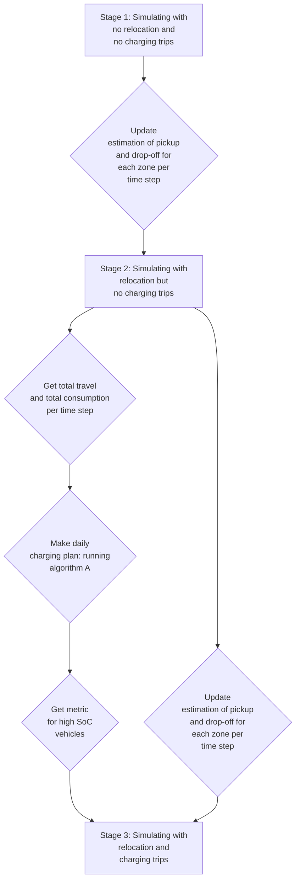

# Libraries to install 


Please install:

 - Python 3.7 
 - Jupyter notebook 
 - jupyter_contrib_nbextensions from https://jupyter-contrib-nbextensions.readthedocs.io/en/latest/install.html
 - jupyter_nbextensions_configurator from
   https://github.com/Jupyter-contrib/jupyter_nbextensions_configurator
Once you open jupyter hopepage, navigate to Nbextensions tab and enable the following features:
 - Table of Contents (2)
 - highlighter
 - Codefolding
 
Other python libraries to install: 
Common libraries:
[numpy, pandas, json, matplotlib, ast]
More specific libraries
[shapely,  geopandas, geopy, functools, requests, glob,  gurobipy (install from grouby installation folder), scipy, sklearn, imageio, seaborn]
if the main directory of your gurobi installation does not have a python37 version for gurobipy:
			copy and replace the content of the folder "gurobipy installation" in the directory of the main gurobi installation, using the new setup.py you should be able to use gurobipy with python3.7 .

# Files
The list of files you should have:
From PTV:
 - xserver
 - simulator (folder)
 - dispatcher_service.exe
 - ScenarioParameters.json 
 (the fleet_size, vehicle_capacity, max_waiting_time can be set here)
 - start.bat

For charging:
 - options.py
 - run_this_before_each_simulation.py
 - charging.py
 - charging_prams.py
 - scenarios folder, including a selection of scenarios with a description file
 - data (folder) including zones shapefile and OD matrix
 - GeneratingScenarios_MakingDailyChargingPlan_VisualizingResults.ipynb
 
# Run ready made scenarios
### Running the simulation
 - [ ] start xsever:
 - [ ] make a high performance routing network for Barcelona (only once for all the runs) :
	 - Go to xserver location on your browser, by default localhost:50000
	 - Under administration, choose Raw Request Runner
	 - choose the following options [XData/JSON/experimental/startCreateHighPerformanceRoutingNetwork]
	 - Put in the following request, and send (this takes some time):
```java	 
	  {"label": "barcelona",

		"scope": "barcelona",

		"storedProfile": "car",

		"highPerformanceRoutingNetworkOptions": {

		"geographicRestrictions": {

		"allowedCountries": [

		"ES"]}}}
```
 - [ ] start.bat, dispatcher.exe, ScenarioParameters.json, and simulator folder should be in the same directory (refered to as main directory from now on)
 - [ ] set the following in start.bat:
- --energy_step_exe: Path to executable installed by your python distribution (e.g. "C:\Software\python.exe")
-  --energy_step_script "charging.py"
- --options_step_exe: Path to executable installed by your python distribution  (same as above)
- --options_step_script "options.py"
-  --kpi_file "KPI.json"
- --log_file "simulation_log.txt"
 - [ ] choose scenario and copy its folder "example_scenario" to the main directory
 - [ ] from "example_scenario" folder copy TripRequests.json and Nodes.txt and paste them in the main directory
 - [ ] set the following in charging_prams.py :
```python
scenario_name='example_scenario'
STAGE=3
LOG=True/False
SoC_in_assignment=True/False
lazy_charging=True/False
```
 - [ ] set the following in ScenarioParameters.json, or just use the ScenarioParameters.json that came with the charging files :
- "AcceptableWaitingTime": 600
- "MaximumDetourFactor": 1.6
- "FleetSize": 150
- "SeatCapacity": 6
 - [ ] run run_this_before_each_simulation.py
 - [ ] run start.bat
 - [ ]  after the simulation is over, copy the vehicle%d.csv files to the directory 'example_scenario/results/3/toure and trajectory'
### Visulizing the results 
To look at the results start the jupyter notebook GeneratingScenarios_MakingDailyChargingPlan_VisualizingResults.ipynb, which should be placed in the main directory. Further instructions follow in the notebook, in short:
- [ ] Enter the name of the scenario
- [ ] Make sure you see the table of content on the left (you should see 4 main sections)
- [ ] Run every cell section 1
- [ ] Run every cell in section 4

You will see the plots, and KPI in the notebook, they will also be saved to the results folder ('example_scenario/results/3/toure and trajectory'), location of the vehicles through the simulation is saved as Gif files and are not shown in the notebook.
# Making a scenario

### General scheme:

### Set the prameters of the scenario:
Here find where each parameter should be changed, first the relavent file is specified, and then the variable's name:
"notebook" is used as shortcut for "GeneratingScenarios_MakingDailyChargingPlan_VisualizingResults.ipynb"

Scenario name: 
 - charging_pram.py:  scenario_name
 - notebook: scenario_name

Stage:
 - charging_pram.py: STAGE
 - notebook: stage

Charging method:
 - charging_pram.py: [SoC_in_assignment, lazy_charging]
 - notebook: only applicable when visulizing (stage=4) [SoC_in_assignment, lazy_charging]
 -----------------
Operating hours:
 - charging_pram.py: [*operation_start_time, operation_end_time*]
 - notebook: [*operation_start_time, operation_end_time*]
 
Fleet size: 
 - ScenarioParameters.json: *FleetSize*
 - notebook: *fleet_size*
 
Driving range:
 - charging_pram.py: *DrivingRange*
 - notebook: *DrivingRange*
 
Number of chargers:
 - notebook: [*number_of_slow_plugs, number_of_slow_stations, number_of_fast_plugs, number_of_fast_stations*]
 
Charging rate:
 - charging_pram.py: *charging_time*
 - notebook: *charging_time*
 
 Seat Capacity:
 - ScenarioParameters.json: *SeatCapacity*
 
Max wating time:
 - ScenarioParameters.json: *AcceptableWaitingTime*
 
Max dtour:
 - ScenarioParameters.json: *MaximumDetourfactor*
 
---------
Reoptimization frequency of charging:
 - charging_pram.py: *time_step_online*
 - strat.bat: *energy_time_step*
 
Objective weigths of algorithm A:
 - notebook: *penalty_A*
 
Objective weigths of algorithm B, C, R:
 - charging_pram.py: [*penalty_B, penalty_C, penalty_R*]
 
Total expected demand:
 - notebook: *es_total_demand*
 
### Walk through:
#### Stage 1
To generate a scenario start with the jupyter notebook GeneratingScenarios_MakingDailyChargingPlan_VisualizingResults.ipynb, which should be placed in the main directory:
Use Sections 1 and 2 to genarete a scenario the notebook includes a guid to choose number of zones, number of requests, and location of charger stations. Set white noise factor $w$ to 0, set morning and evening bias factors $b\_morning$, $b\_evening$ to 0 for stage=1.
Once scenario is generated by running all relavent cells to stage=1 in the notebook, follow the checklist below to run the simulation with no relocation or charging:
 - [ ] from "new_scenario" folder copy TripRequests.json and Nodes.txt and paste them in the main directory
 - [ ] set the following in charging_prams.py :
```python
scenario_name='new_scenario'
STAGE=1
LOG=True/False
SoC_in_assignment=False
lazy_charging=False
```
 - [ ] set the value for fleet_size in ScenarioParameters.json
 - [ ] run run_this_before_each_simulation.py
 - [ ] run start.bat
 after the simulation is over, copy the vehicle%d.csv files to the directory 'new_scenario/results/1/toure and trajectory'
 #### Stage 2
 go to GeneratingScenarios_MakingDailyChargingPlan_VisualizingResults.ipynb and use Sections 1 and 2 to genarete a scenario to for stage=2. Follow the checklist below to run the simulation with relocation but no charging:
 - [ ] from "new_scenario" folder copy TripRequests.json and Nodes.txt and paste them in the main directory
 - [ ] set the following in charging_prams.py :
```python
STAGE=2
```
 - [ ] run run_this_before_each_simulation.py
 - [ ] run start.bat
 after the simulation is over, copy the vehicle%d.csv files to the directory 'new_scenario/results/2/toure and trajectory', replacing the privous ones
 #### Stage 3
 go to GeneratingScenarios_MakingDailyChargingPlan_VisualizingResults.ipynb and use Sections 1, 2, and 3 to genarete a scenario to for stage 3.  In this stage you can set white noise factor, morning and evening bias factor for the demand.
Section 3 in the jupyrter notebok will read trejectory data from stage 2 get travel time and distance from xroute for those trejectories. With this it will calculate the input to algorithm A. Then it will run algorithm A and write the solution to folder of the scenario. You will also observe the plan by algorithm A in section 3. Further guidline is included in the notebook.
Follow the checklist below to run the simulation with relocation and charging:
 - [ ] from "new_scenario" folder copy TripRequests.json and Nodes.txt and paste them in the main directory
 - [ ] set the following in charging_prams.py :
```python
STAGE=3
LOG=True/False
SoC_in_assignment=True/False
lazy_charging=True/False
```
 - [ ] run run_this_before_each_simulation.py
 - [ ] run start.bat

